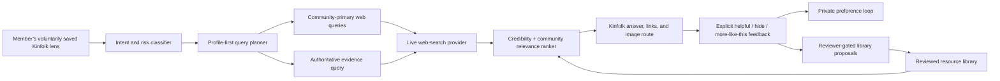

# Kinfolk AI — Profile-First Web Search Starter

This Replit-ready TypeScript service implements the operating rule you specified: **a voluntarily saved Kinfolk community lens is applied before every web search**. It turns a member’s self-described identity context into community-primary queries, searches the live web, ranks credible community-relevant results first, routes image requests to reviewed galleries, and learns through a review-gated feedback loop.

> **Kinfolk’s rule:** the active community lens is not a hashtag the member has to remember. It is the first retrieval instruction the system uses.

## What this starter does

| Capability | Kinfolk behavior |
| --- | --- |
| **Profile-first web search** | Loads the member’s active, self-declared lens before a search provider is called. It creates community-primary queries first and retains an authoritative evidence query for accuracy. |
| **Health context** | For `blood pressure` and `preeclampsia`, it leads with the profile-relevant context and source-linked population information while preserving universal clinical guidance. It never turns group data into an individual diagnosis. |
| **Eczema images** | For `eczema show me pictures`, it creates a representation-aware image query and presents a reviewed external gallery of eczema on Black and Brown skin. The library includes the Eczema in Skin of Color gallery.[1] |
| **Michelle Williams precision** | For `Michelle Williams`, it prioritizes `Michelle Williams Destiny's Child singer`, while retaining the *Dawson’s Creek* actor as a separate candidate. This prevents name conflation. |
| **Feedback flywheel** | A member can save helpful/not-helpful feedback. Positive shared-source signals create a **proposal**, not an auto-published result; a reviewer must approve any addition to the shared library. |
| **Member control** | The lens is explicit in each request, therefore it can be edited, paused, or erased. Kinfolk does not infer or silently store race, ethnicity, gender, pregnancy status, or medical conditions. |

## The Kinfolk flywheel



The two feedback paths are deliberately separate. **Private preference feedback** can personalize the member’s future ranking. **Shared-library feedback** may only propose a source; it cannot automatically change community results. This prevents a small number of clicks, spam, or manipulated content from defining the public Kinfolk library.

## The exact pre-search logic

For a member whose active lens is `Black woman`, a query for `blood pressure` produces this search plan before the live web call:

| Order | Query role | Example query | Why it exists |
| --- | --- | --- | --- |
| 1 | Community-primary | `high blood pressure Black woman trusted health resources` | Starts from the saved community lens. |
| 2 | Community-primary | `hypertension Black woman community health` | Finds community-relevant resources and context. |
| 3 | Community-primary | `blood pressure Black woman population context CDC` | Finds clearly labeled population context. |
| 4 | Evidence | `blood pressure official health guidance` | Maintains the clinical evidence floor. |

For an eczema image request, the first query becomes `eczema in skin of color clinician reviewed images`, and the reviewed library presents the **Eczema in Skin of Color — Image Library**. The gallery contains educational examples across Black, Brown, Hispanic/Latino, and White skin; Kinfolk labels it as educational, not diagnostic.[1]

For pregnancy hypertension or preeclampsia, the library includes CDC guidance. CDC identifies severe headache, vision changes, upper stomach pain, nausea or vomiting, face/hand swelling, sudden weight gain, and trouble breathing among preeclampsia symptoms; eclampsia is an emergency.[2] Kinfolk surfaces urgent-care guidance immediately for pregnancy/postpartum danger language, before source ranking.

CDC also publishes population-level blood-pressure data by group. Kinfolk may present those data as **community context** for a member who wants them, but the application must state that group statistics do not determine an individual’s diagnosis or outcome.[3]

## Replit setup

Create a new Node.js/TypeScript Replit project, then upload these files or import this folder. In the Replit Shell, install dependencies and run the service:

```bash
npm install
npm run dev
```

Add these entries in **Replit Secrets**. Do not place real values into `.env.example` or commit secrets to a repository.

| Secret | Required | Purpose |
| --- | --- | --- |
| `TAVILY_API_KEY` | Yes | Enables live web search. The service calls the current Tavily `POST /search` endpoint. [4] |
| `OPENAI_API_KEY` | Optional | Enables answer synthesis over the already retrieved source packet. Without it, Kinfolk still returns rank-ordered live sources and deterministic answer leads. |
| `OPENAI_MODEL` | Optional when `OPENAI_API_KEY` is set | The model name for answer synthesis, such as `gpt-4.1-mini`. |
| `OPENAI_BASE_URL` | Optional | Use only if your OpenAI-compatible provider uses a non-default base URL. |
| `ADMIN_TOKEN` | Required only for the library-proposals endpoint | Protects the reviewer-facing proposal list. |

## API contract

### `POST /v1/search`

The API takes the query and the active voluntary profile in the same request for this starter. In production, authenticate the member, load their encrypted profile server-side, and do not trust a client-supplied member ID.

```json
{
  "query": "blood pressure",
  "profile": {
    "id": "member-123",
    "active": true,
    "activeLensIds": ["black-woman"],
    "lenses": [
      {
        "id": "black-woman",
        "label": "Black woman",
        "searchTerms": ["Black women", "African American women", "African diaspora"],
        "priority": 0
      }
    ],
    "preferredDomains": [],
    "blockedDomains": [],
    "locale": "en-US"
  }
}
```

The response contains the answer lead, an editable lens disclosure, the exact query plan, ranked live results with reasons, reviewed resource cards, and a next action. The response intentionally exposes the query plan so the member can see and correct how Kinfolk used their lens.

### `POST /v1/feedback`

```json
{
  "memberId": "member-123",
  "query": "blood pressure",
  "resultUrl": "https://example.org/community-resource",
  "action": "more_like_this",
  "createdAt": "2026-08-14T12:00:00.000Z",
  "activeLensIds": ["black-woman"]
}
```

This endpoint returns a `proposed` library record when eligible. **It never auto-approves a shared source.** Add a reviewer dashboard that checks medical/editorial quality, representation, expiration date, ownership, and safety before promoting a proposal into `src/library.ts` or its production database equivalent.

### `GET /v1/library/proposals`

Send a matching `x-admin-token` header. This is a reviewer-only endpoint and should be connected to real authentication and an audit log before production use.

## Run the acceptance tests

```bash
npm test
npm run typecheck
```

The tests verify the essential product promise: a Black-woman profile produces community-primary blood-pressure and eczema image queries before the general evidence track, and `Michelle Williams` begins with the Destiny’s Child candidate while preserving the *Dawson’s Creek* candidate for disambiguation.

## Files to keep as the product brain

| File | Role |
| --- | --- |
| `CORE_SPEC.md` | The precise product script and model instruction that explains how Kinfolk is supposed to think. |
| `src/planner.ts` | Converts query + voluntary profile into the community-primary and evidence query plan. |
| `src/search-provider.ts` | Sends the plan to live web search. Replace this adapter if you choose another search provider. |
| `src/ranker.ts` | Scores credibility, community relevance, and the member’s expressed source preferences. |
| `src/library.ts` | Reviewed sources, image routes, and entity candidates. |
| `src/engine.ts` | Connects plan → web → rank → library → answer. |
| `src/feedback.ts` | Private relevance loop and reviewer-gated shared-library proposals. |
| `src/response-composer.ts` | Optional ChatGPT-style prose layer constrained to the verified source packet. |

## Deployment choices

| Approach | Tradeoffs | Cost | Setup complexity |
| --- | --- | --- | --- |
| **Replit service with live web search** | Delivers the live Kinfolk experience and current sources; requires API secrets and production authentication before public release. | Depends on the chosen search and language-model providers. | Moderate. |
| **Local/demo mode with a mocked search adapter** | Lets your team validate the pre-search logic and screen flow without external credentials; does not search the live web. | No search-provider usage. | Low. |

## Production requirements before public launch

This starter intentionally focuses on the core reasoning loop. Before public release, add member authentication, encrypted at-rest profile storage, consent and deletion workflows, per-member rate limits, abuse detection, audit logging, source-review tooling, API-error monitoring, and a medical-content review process. Because community profile labels are sensitive, collection must be voluntary, transparent, and revocable.

Do not use Kinfolk as a diagnostic, emergency, or prescribing service. The health experience should make it easy to reach trusted care and emergency services, especially when a user reports urgent symptoms.

## References

[1]: https://eczemainskinofcolor.org/image-library/ "Eczema in Skin of Color — Image Library"

[2]: https://www.cdc.gov/high-blood-pressure/about/high-blood-pressure-during-pregnancy.html "CDC — High Blood Pressure During Pregnancy"

[3]: https://www.cdc.gov/high-blood-pressure/data-research/facts-stats/index.html "CDC — High Blood Pressure Facts"

[4]: https://docs.tavily.com/documentation/api-reference/endpoint/search "Tavily — Search API Reference"
