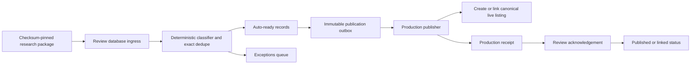

# Replit Handoff: Automated Directory Reconciliation and Publication

**Author:** Manus AI
**Date:** 2026-09-19
**Release source:** `b2e6f7f265d95705e39b18acb9de21e26d0adcfa`
**Status:** Implementation and infrastructure handoff; no records have been staged, merged, archived, or published by this document.

## Outcome required

The founder must **not** review hundreds of business rows one by one. Replace the current manual review list with an automated, auditable process that does four things:

1. Consolidates obvious repeats in the existing live directory without deleting historical records or breaking saved items, claims, reviews, messages, user accounts, or any other existing feature.
2. Classifies research-package candidates automatically and collapses exact repeats before a human ever sees them.
3. Automatically creates or links only policy-qualified records through a narrowly scoped production publisher.
4. Shows the founder only an **exceptions queue** for ambiguous, regulated, unsupported, inaccessible, or otherwise unsafe records.

The current Businesses screen is not an approval tool. Its visibly repeated “Duke’s Cafe” rows demonstrate why the live inventory must be reconciled before another large import is added. Treat the screenshot as a signal for an audit, not proof that every same-name row is a duplicate: branches and incomplete address data can produce legitimate same-name rows.

> **Definition — automatic publication policy:** a deterministic set of evidence, identity, location, and routing checks that decides whether a record may be created, linked to an existing record, or held. It is not an unconstrained bulk insert and it must not invent addresses, pins, ownership designations, hours, accessibility information, or professional credentials.

## Two complementary workstreams

| Workstream | Purpose | Founder workload | Production effect |
|---|---|---:|---|
| Existing-directory reconciliation | Remove duplicate search/map results such as repeated same-location businesses while preserving data and history. | No row-by-row review. The system produces a reversible reconciliation report. | Duplicates become superseded and resolve to a canonical listing; no source row is deleted. |
| Automated source-backed publication | Process new research packages, suppress repeats, create/link qualified records, and collect exceptions. | Review only a short exception queue when desired. | Creates/link records only through the production publisher’s guarded policy. |

The reconciliation workstream should run first. The publication workstream should then process the latest approved review manifest. These are separate actions because the first improves the existing live directory, while the second controls new source-backed additions.

## Required architecture

The existing local-only directory-import route cannot be enabled in production. It uses one database transaction for both review records and the live `businesses`/`resources` tables. Its safety guard intentionally rejects production. Do not weaken that guard, point it at the production database, or use the general Businesses page as a substitute.

Implement a separate review database and a production publication queue.

### Review database boundary

Provision a **separate PostgreSQL database** for the review queue. It must not share `DATABASE_URL`, tables, or credentials with the production application database.

The review database contains only directory-review records, such as:

- `directory_review_batches`
- `directory_review_candidates`
- `directory_review_decisions`
- `directory_review_outbox`
- `directory_review_command_acks`

It must not contain users, authentication sessions, waitlist data, Community data, payment data, Stripe data, or live business/resource tables. Store the authenticated actor’s existing production user ID as opaque audit text only; do not create a second founder login.

### Production publication boundary

Create a narrow production publisher with its own production-side audit tables, such as:

- `directory_publication_inbox`
- `directory_publication_provenance`
- `business_duplicate_resolutions`

The publisher is the only new component allowed to create a business, create a resource, or link a candidate to an existing canonical record. Each command must have an immutable `command_id` and payload SHA-256. The production inbox must make processing idempotent: duplicate delivery of the same command returns the prior result rather than creating another listing.

The application continues to use the existing normal authenticated admin session for founder access. The review database does **not** authenticate users and cannot query or modify accounts, sessions, waitlist, Community, payments, or membership data.

## Automatic reconciliation of the current live directory

Create a reversible reconciliation job before adding another package. It must never delete a business row.

### Candidate grouping

Group records by the strongest identity available, in this order:

1. Exact normalized name, numbered street address, city, state/province, and country.
2. Exact normalized name, city, state/province, and matching official customer destination host or matching phone number.
3. Any weaker match is an **ambiguous exception**. Do not merge it automatically.

Do not treat name plus city alone as a duplicate. That would incorrectly merge branches or separate businesses with common names.

### Canonical record selection

For an exact duplicate group, choose the canonical record using a deterministic completeness score. Prefer, in order, an existing verified/claimed record, a record with an official customer destination, a complete numbered address, valid coordinates from approved location evidence, richer source evidence, then the oldest stable record ID as a final tie-breaker.

Write the result to `business_duplicate_resolutions` with the canonical ID, superseded ID, evidence summary, policy version, scoring inputs, job run ID, and timestamp. Do not modify or delete the superseded record’s core evidence.

### Public behavior after reconciliation

Update the centralized public-business visibility query or view so superseded records no longer appear in search, map results, discovery, or Kinfolk business retrieval. A request for an old superseded business detail URL should resolve to its canonical listing. This preserves saved links and avoids breaking references.

Add an internal reconciliation report showing the number of exact duplicate groups, canonical records, superseded records, ambiguous groups, and records excluded from automatic action. The founder should see this report rather than a repetitive list of row-level edit/archive buttons.

## Automated policy for new research packages

The importer must accept only a versioned JSONL review package accompanied by its expected SHA-256 checksum, summary count, and destination-health report. It must reject changed manifests, malformed rows, unexpected fields, duplicate source row IDs, or attempts to target a production table directly.

### Automatically handle without individual approval

| Candidate outcome | Required conditions | System action |
|---|---|---|
| Exact duplicate inside the same package | Same normalized identity and the same customer destination evidence. | Retain one canonical review candidate; mark the other source rows `deduplicated` and preserve their source attribution. |
| Exact existing live listing | Production publisher finds one exact canonical identity match. | Do not insert a new business. Link the candidate to the existing listing and record immutable provenance. |
| Physical business auto-ready | Numbered street address; city/state/country match; active official customer destination; no unresolved identity collision; no regulated-service, unsupported ownership, or other hold. | Queue one unclaimed, unverified business publication. Geocode only after address validation passes. |
| Online-only business auto-ready | Valid reachable official website or public business social destination; no physical address/pin; no unresolved hold. | Queue an online-only listing with no map pin. |
| Community resource | Reputable current source and the correct resource category. | Send to the resource path only; never create a business automatically. |
| Regulated, cultural, ownership, broken-link, missing-address, ambiguous, or manual-review record | Any condition that requires judgment or cannot be independently verified. | Hold as an exception; never bulk-create it. |

The policy must keep the existing safeguards: server-side URL validation, no private-network link retrieval, source-bound location evidence, no `(0,0)` fallback, no location for online-only services, and no unsupported claims about ownership or credentials.

### Batch-level founder interaction

The founder does not approve individual ordinary listings. The automated worker processes auto-ready records after a batch is released by the system’s configured automation policy. The founder page defaults to a concise operational summary:

- received, deduplicated, linked to existing, queued, published, and exception counts;
- a downloadable audit report with manifests, checksums, command IDs, and outcomes; and
- an exceptions-only list.

A normal founder/admin session may pause a batch or review an exception, but no additional user account or database credential is required.

## Exactly-once publication behavior

A review database and the production database cannot safely share a single transaction. Do not attempt a fragile cross-database transaction or use prepared transactions. Use an outbox/inbox handoff instead.

1. The review database transaction locks the candidate, records the deterministic outcome, and creates one immutable publication command.
2. A bounded publisher worker leases that command and attempts delivery to production.
3. The production transaction inserts or locks the command ID in `directory_publication_inbox`, then creates or links exactly one canonical record and writes local provenance.
4. If the same command is delivered again, the production inbox returns the already committed result.
5. The review database records the acknowledgement and marks the candidate `published`, `linked_existing`, or `needs_review`.

If a process stops after production commits but before review acknowledgement, the command remains safe: the next attempt reads the production receipt and acknowledges it. The system must never insert a second business merely because a worker retried.

## Required additive implementation changes

| Area | Required change |
|---|---|
| `artifacts/api-server/src/directoryImport/` | Add isolated review database configuration, review migrations, review repository, deterministic classifier, review ingress, outbox, and acknowledgement handling. Keep the existing local-only route disabled rather than weakening its production guard. |
| `artifacts/api-server/src/lib/startup-migrations.ts` | Split legacy directory-review migrations from ordinary production migrations. Run production publisher migrations against the production pool and review migrations only against the separate review pool. Do not auto-create review tables in the production database. |
| `artifacts/api-server/src/app.ts` and `index.ts` | Register the new review route only after existing auth middleware and isolated-review configuration/schema checks pass. Preserve the current auth middleware and `isAdmin` check. |
| Production publisher | Extract guarded business/resource create/link behavior into a production-only service. Re-run deterministic live collision checks at publish time. |
| Existing public discovery query | Add a centralized superseded-record exclusion and canonical detail resolution using `business_duplicate_resolutions`. Apply it to business search, map/discover, Kinfolk business retrieval, and detail lookup without deleting data. |
| Founder review UI | Replace row-by-row approval as the default with batch status, reconciliation report, and exceptions queue. Remove unrelated hard-coded defaults. |
| Package tools | Keep checksum/package builders offline. Replace any database-writing `--apply` path with the authenticated isolated review ingress. |

## Required environment and database setup

Replit or the production operator must provision the following through the hosting platform’s secret/settings UI. Do not commit, paste, print, rotate, or expose values in source control or chat.

| Setting | Purpose |
|---|---|
| `DATABASE_URL` | Existing production application database. Leave existing value and permissions unchanged. |
| `DIRECTORY_REVIEW_DATABASE_URL` | New, separate review database. It must not identify the same database as `DATABASE_URL`. |
| `DIRECTORY_REVIEW_ENABLED=1` | Enables only the isolated review subsystem after both schemas verify. |
| `DIRECTORY_REVIEW_SIGNING_SECRET` | Existing or new high-entropy server-side signing secret for signed review evidence. |
| `DIRECTORY_PUBLICATION_WORKER_ENABLED=1` | Enables the bounded publisher worker after a clean deploy and schema verification. |
| `DIRECTORY_PUBLICATION_WORKER_CONCURRENCY=1` | Starts conservatively with a single publisher worker until the audit report confirms stable behavior. |

Use least-privilege database roles. The review API role may access only review tables. The normal production app role retains its current permissions. The publisher role receives only the production tables and operations required for canonical business/resource create-or-link and audit receipts.

## Deployment and execution sequence

1. Deploy the implementation from the exact current GitHub main SHA after the code and tests below are merged.
2. Provision the separate review database and least-privilege roles through the platform settings. Do not put a production database URL in a review setting.
3. Run schema checks against both databases. A failed check must stop traffic to the review subsystem and must not create or publish a listing.
4. Run the existing-directory reconciliation in **dry-run mode**. Produce the duplicate report and confirm that no broad name-only merges are proposed.
5. Run the reconciliation apply action. It writes only reversible resolutions; it does not delete business rows.
6. Verify public search, map, business detail redirects, Kinfolk recommendations, saves, follows, claims, and business-owner flows against a small set of known duplicate/canonical pairs.
7. Submit the exact checksum-pinned manifest to the review ingress. The ingress must report received, auto-ready, deduplicated, held, and invalid counts.
8. Run the publisher with concurrency `1`. Verify production receipts, no duplicate canonical keys, no duplicate pins, online-only maplessness, and destination links.
9. Publish an operational report with total staged, deduplicated, linked-existing, created, held, and failed counts. State only verified post-publication counts as live.

## Acceptance tests

The implementation is not complete until all of the following pass.

1. Existing founder/admin login works unchanged and remains required before review pages load. Non-admin and unauthenticated requests return `403` and `401` before any review query.
2. The review and production database URLs identify different database instances. The review role cannot query production business, resource, user, session, waitlist, Community, or payment tables.
3. An exact duplicate group produces one canonical public listing and one or more reversible supersession mappings. No business row is deleted.
4. A shared business name in the same city with a different address is held as ambiguous rather than merged.
5. Repeated delivery of one publication command creates or links one live record only.
6. A production commit followed by a simulated acknowledgement failure recovers without a second record.
7. A physical listing has no map pin without source-backed, reviewed address evidence. An online-only listing has no map pin by design.
8. Resources never enter the `businesses` table. Regulated, cultural, and unsupported ownership records remain exceptions.
9. Existing auth, reset password, tester temporary-password prompt, accounts, sessions, approval, users, waitlist, Community, DMs, circles, saves, profile settings, business-owner flows, Kinfolk feedback, Library, and payment surfaces retain their current test coverage and behavior.
10. The final report distinguishes GitHub merge, deployed code, staged review data, published production data, native builds, uploads, store submissions, and releases.

## Do not do these things

Do not enable `DIRECTORY_IMPORT_LOCAL_STAGING` in production. Do not point the old local-only route at `DATABASE_URL`. Do not bulk-insert into `businesses`, auto-geocode to `(0,0)`, delete apparent duplicates, merge records based on name and city alone, or publish records with unverified identity/location evidence. Do not give the review database access to users, passwords, sessions, waitlist, Community, or payment tables.

## Founder-facing result

After this is live, the founder will see a short dashboard instead of 500 repeated rows. It will say, for example: “320 exact repeats consolidated, 92 exact existing listings linked, 61 qualified new listings published, 27 exceptions held.” The exact counts must come from the production receipts and reconciliation report; they must not be claimed in advance.

## References

[1]: https://github.com/Melaninmaps/melanin-maps-api/tree/b2e6f7f265d95705e39b18acb9de21e26d0adcfa "Mapping with Melanin exact release source"
[2]: https://github.com/Melaninmaps/melanin-maps-api/blob/b2e6f7f265d95705e39b18acb9de21e26d0adcfa/docs/handoffs/SOURCE_BACKED_INVENTORY_PUBLICATION_RUNBOOK_2026-09-17.md "Source-backed inventory publication runbook"
